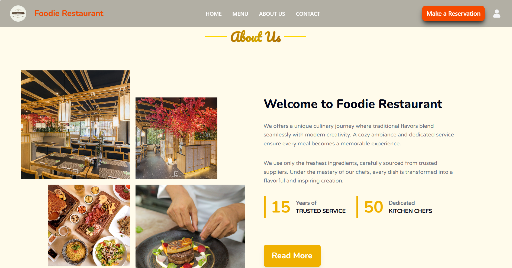
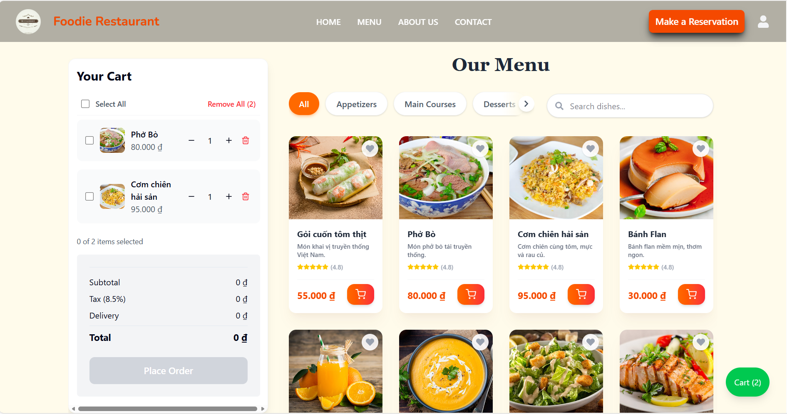

# Food Ordering Platform – Modern Full-stack Architecture

> **A high-performance and responsive food ordering system developed with Next.js 15, utilizing modern state management and real-time data fetching mechanisms.**

---

## Preview
<div classname="text-center">
    
    <p><i>Figure 1: Home Page interface showcasing a modern, user-centric, and fully responsive layout.</i></p>
</div>

<br/>

<div classname="text-center">
    
    <p><i>Figure 2: Menu interface integrated with intuitive drag-to-scroll navigation and real-time smart search functionality.</i></p>
</div>

---

## Abstract
This project is a core component of a comprehensive order management system, specifically designed to optimize **User Experience (UX)** and data processing efficiency. As an **Information Systems (IS)** student at **Sai Gon University (SGU)**, I focused on building a sustainable and scalable frontend architecture that integrates seamlessly with a **FastAPI** backend.

---

## Key Features
* **Modern UI/UX**: Features a sleek interface built with **Tailwind CSS**, including smooth **drag-to-scroll** functionality for menu categories.
* **Real-time Data Fetching**: Utilizes **SWR** (Stale-While-Revalidate) to ensure menu data is always up-to-date without interrupting the user experience.
* **Global State Management**: Professionally manages cart logic and application data flow using **Redux Toolkit**.
* **Responsive Design**: Optimized for perfect display across all devices, from mobile phones to desktops.
* **Smart Search**: Includes a **MenuSearch** component with intelligent filtering for high-performance, real-time dish queries.

---

## 🛠 Tech Stack

### **Core Framework & Language**
* **Next.js (15.3.5)**: Leveraging the App Router for optimized page load performance and SEO.
* **TypeScript**: Ensures code robustness and data integrity throughout the development lifecycle.

### **State & Data Handling**
* **Redux Toolkit**: Centralized state management for complex cart workflows and global application state.
* **SWR & Axios**: Handling asynchronous API requests with smart caching and revalidation mechanisms.

### **Styling & Components**
* **Tailwind CSS**: Rapid UI development with a utility-first architecture and seamless responsiveness.

---

## 🏗 System Architecture

The system follows a decoupled architecture for maximum maintainability:
* **Frontend (This project)**: Next.js deployed on the Vercel platform.
* **Backend Repository**: [👉 View FastAPI Source Code](https://github.com/nvhao100604/order_fast_api).

---

## Getting Started

### **1. Clone the repository**
```bash
git clone https://github.com/nvhao100604/order-front-end.git
cd order-front-end
```

### **2. Setup Environment Variables**

- Copy the example file: 
```bash
cp .env.example .env
```
- Open .env and adjust the values to match your local or production environment (e.g., update NEXT_PUBLIC_API_BASE_URL to your deployed backend link).

### **3. Install Dependencies**
```bash
npm install
```

### **4. Run Development Server**
```bash
npm run dev
```

Open [http://localhost:3000](http://localhost:3000) to view the result in your browser.

## 🌐 Live Demo
👉 [Experience the live application here](https://order-vh.vercel.app)

## Contact
- Author: Nguyễn Văn Hào

- Position: Final-year Information Systems Student at Sai Gon University

- Location: Binh Dong Ward, Ho Chi Minh City

- GitHub: [nvhao100604](https://github.com/nvhao100604)